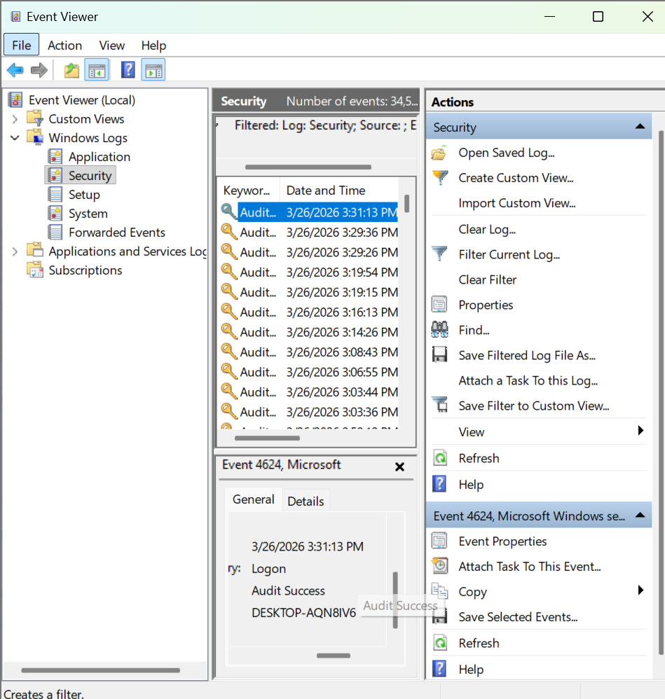
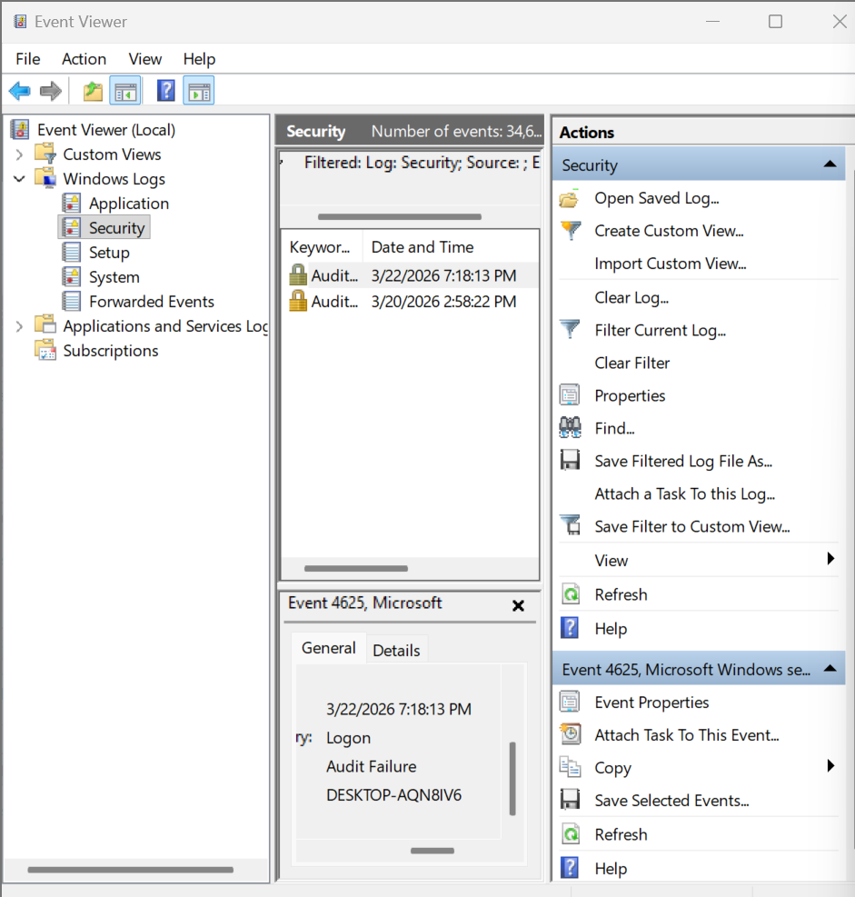
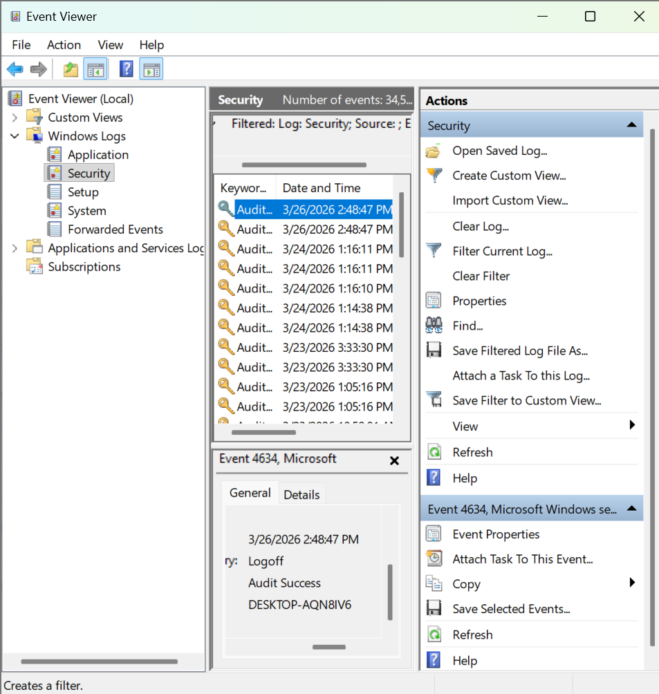

# Intrusion Methodologies & Log Analysis

## Overview
This project focused on understanding how cyber intrusions occur and how security analysts identify suspicious activity using system logs. The work was completed as part of a hands-on lab in a Windows environment.

## What I Learned
I learned how attackers use techniques such as credential abuse, brute force attacks, and misuse of services to gain access to systems. I also practiced analyzing Windows Security logs to identify normal behavior and suspicious login activity.

## Skills & Tools
- Windows Event Viewer
- Log analysis and interpretation
- Identifying indicators of compromise (IOC)
- Understanding Event IDs (4624, 4625, 4634)
- Basic security analyst decision-making

## Key Takeaways
This project helped me understand how to distinguish between normal system activity and potential security threats. I learned how to analyze login patterns and recognize signs of possible brute force attempts.

## Note
This project is conceptual and does not include any sensitive system or client data.
## Sample Log Evidence

### Successful Login (Event ID 4624)

### Failed Login (Event ID 4625)

### Logoff Event (Event ID 4634)

